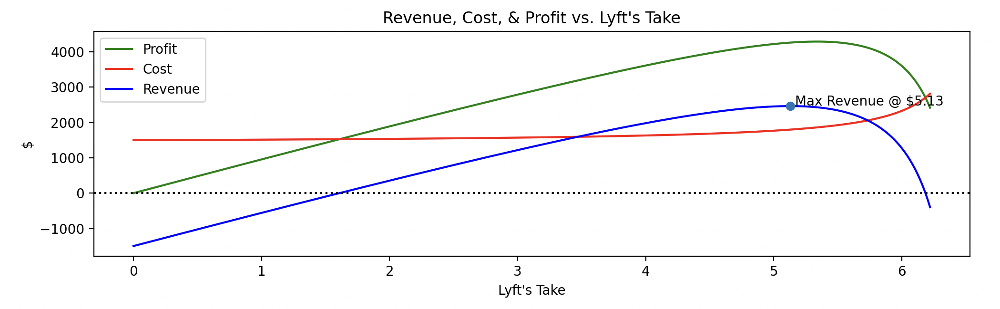

# Solution to _Real Problems We Tackle: Pricing #1_

After making some assumptions about the nature of the data provided in the problem, I'm able to construct functions that define User and Driver Acquisition Cost, Positive Match Rate of a trip, and Revenue. Using Python, NumPy, and Matplotlib, I find that the Revenue Maximizing Trip Fee is _$5.13_ for the Toledo trip. I discuss another method of solving this and why this method might be more practical in a scalable system.

# Assumptions & Details

I had to make some assumptions not specified in the problem to be able to create a pricing model. The following are the assumptions that I made and how they might affect the outcome of the model.

1. _The number of users on the app stays constant over the 12-month period_. I made this assumption because I couldn't calculate user base growth from the information given. In the model, I set the number of users at 1000, but the point at which the revenue is maximized does not vary with number of users, so this constant doesn't mean much in the end.
2. _The number of drivers on the app is only as many as is needed to accommodate the number of users on the app_. This assumption was again made because I was unable to calculate growth of the driver base using the given information. This means that in the model there are 10 drivers.
3. _User and driver acquisition costs have an inverse relationship with the number of users or drivers being acquired_. I made this assumption to simplify and model this behavior. This would mean that a function describing user (or driver) acquisition cost would take the form where is acquisition cost and is number of users acquired. This would make sense for the case of customer acquisition cost because acquiring a single customer would cost some high amount ($20), and then the cost of each additional customer would be incrementally lower as you approach some cost minimum ($10).
4. _Positive match rate has an inverse relationship with Lyft's trip fee_. In this instance, I expanded the function used above slightly to include an offset. The function takes the form where is positive match rate and is Lyft's trip fee. This would make sense for match rate since we would expect that with a $0 fee there would still be some non-zero failure rate, meaning a horizontal asymptote at 1. We would also likely see a vertical asymptote at some fee greater than $6, since driver interest would fall off once they no longer feel they can make money driving.
5. _I ignored the "one or more" part of the line "riders who experience one or more "failed to find driver" events churn at 33% monthly"_ **.** Realistically, User churn would likely be slightly higher over the long run since each user that experiences a failed match would then forever have a 33% chance of churn. Instead, I assumed that for a given month where a user has a failed match, they churn at 33%. This keeps the calculation stateless between months, so that I don't have to keep track of how many users fail to match but don't churn each month.

# Method

I'm familiar with Python, from modelling to creating web apps, so it seemed that using Python with numpy and matplotlib would be the easiest way to model this problem. I created a short script that has functions for customer and driver acquisition costs and positive match rate and outputs a matplotlib plot of Lyft's revenue for a single month. Since I assumed the number of users on the app stays constant over the 12-month period, all I needed to do to find the optimal trip fee was solve for a single month's time period.

# Results

In my script, I plot revenue for all realistic values of Lyft's fee, from 0 to roughly 73/11. Then I find the maximum of that plot. The following is the output of that plot.

As seen in the plot, revenue reaches it's maximum at $5.13. Since I made assumption 5, this conclusion holds for all months of the year, meaning _$5.13 is the optimized trip fee to charge when trying to maximize net revenue_.

# Another Method

I think a more accurate way to do this would be to run a simulation of the revenue over the course of a year, with a growing and shrinking driver and user pool. This would cut out assumptions 1, 2, and 5 and would likely make this more realistic. Unfortunately, there really wasn't a way for me to model growth of the user base without making up my own assumption. If I were a product manager in this case, I would likely try to gather some data on user base growth and use that as a part of the simulation.

What makes this method shine however is that we can take data from each route, not just the Toledo route, and plug it in to this function to find the revenue maximizing fee. This means we could scale the product past the Toledo route and charge fees dynamically across the app. This would likely be a much better price optimizing solution than running a full-blown simulation for each route.
